# 기술매매 대상 수요기업 예측 웹 서비스 프로토타입 개발

## 1. [Docker](https://www.docker.com/) 설치
```bash
# 1. 패키지 업데이트
$ sudo apt update
```
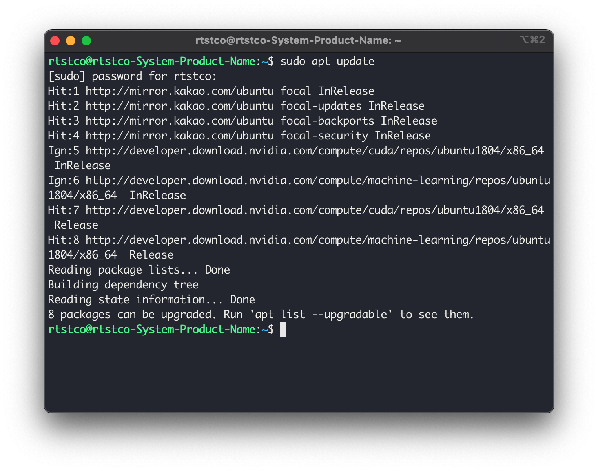
```bash 
# 2. 패키지 업그레이드
$ sudo apt upgrade
```
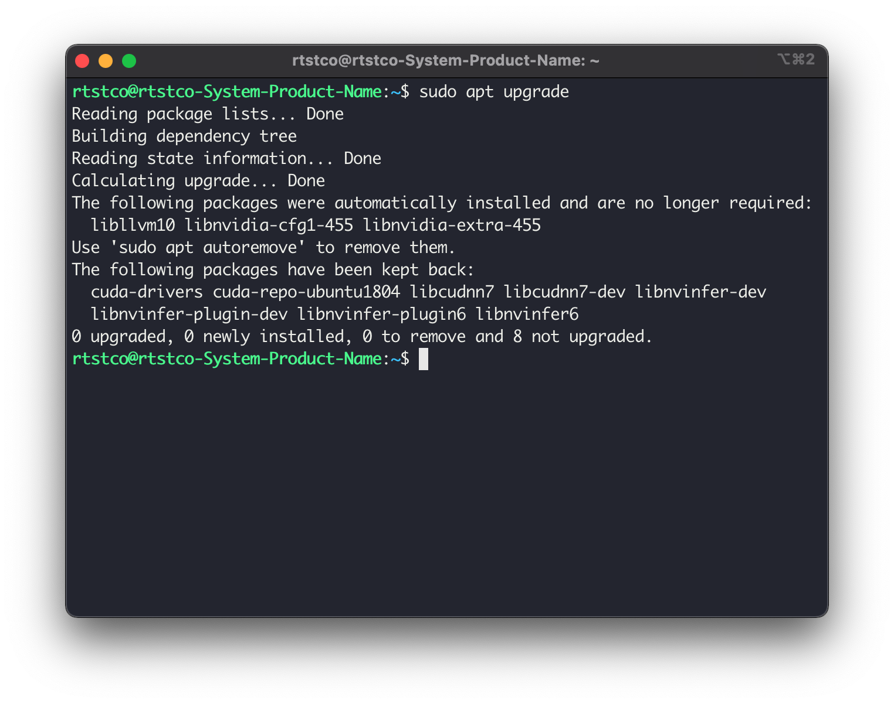
```bash 
# 3. 
$ sudo apt-get install apt-transport-https ca-certificates curl gnupg-agent software-properties-common
```
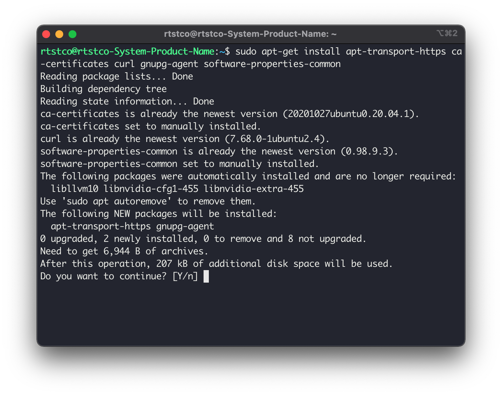
```bash 
# 4. Docker 설치 키 등록
$ sudo curl -fsSL https://download.docker.com/linux/ubuntu/gpg | sudo apt-key add -
```
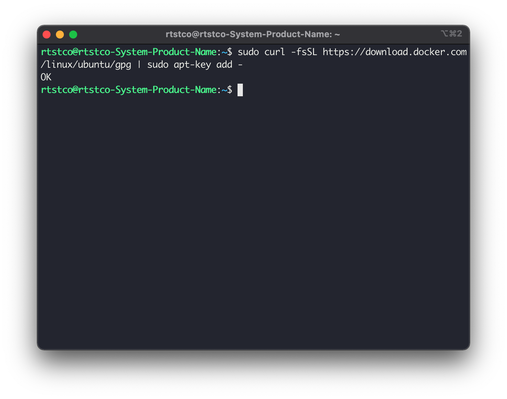
```bash 
# 5. Docker Repo 등록
$ sudo add-apt-repository "deb [arch=amd64] https://download.docker.com/linux/ubuntu $(lsb_release -cs) stable"
```
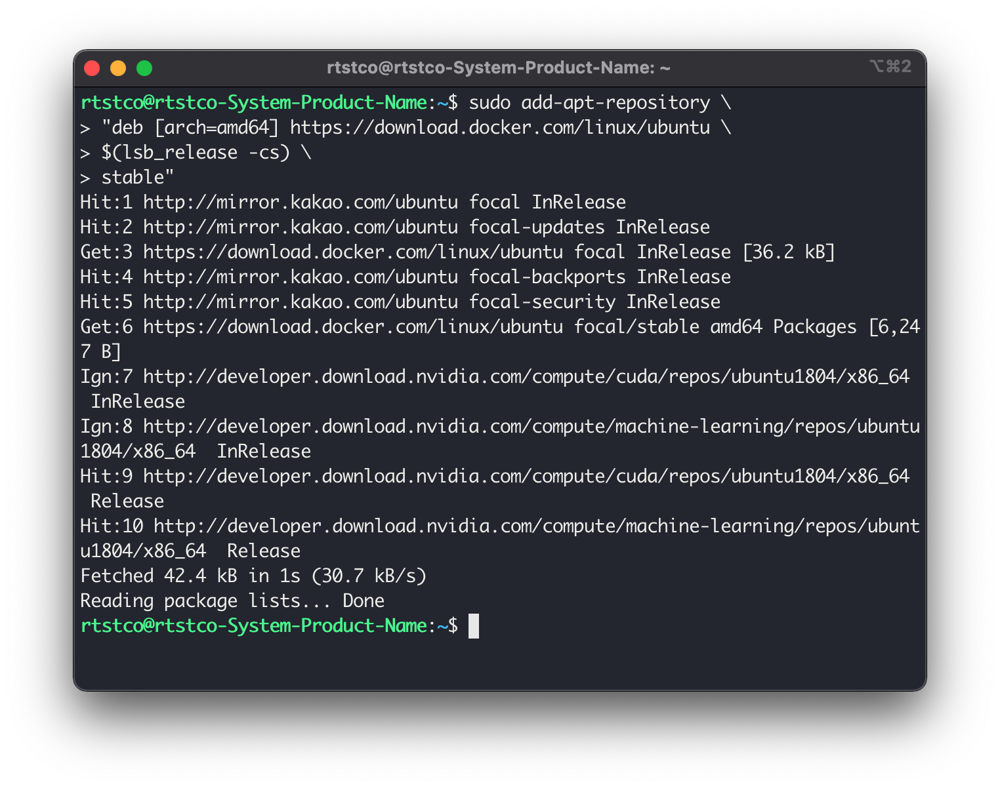
```bash 
# 6. 전체 패키지 업데이트 및 Docker, Docker 관련 패키지 설치
$ sudo apt-get update && sudo apt-get install docker-ce docker-ce-cli containerd.io
```
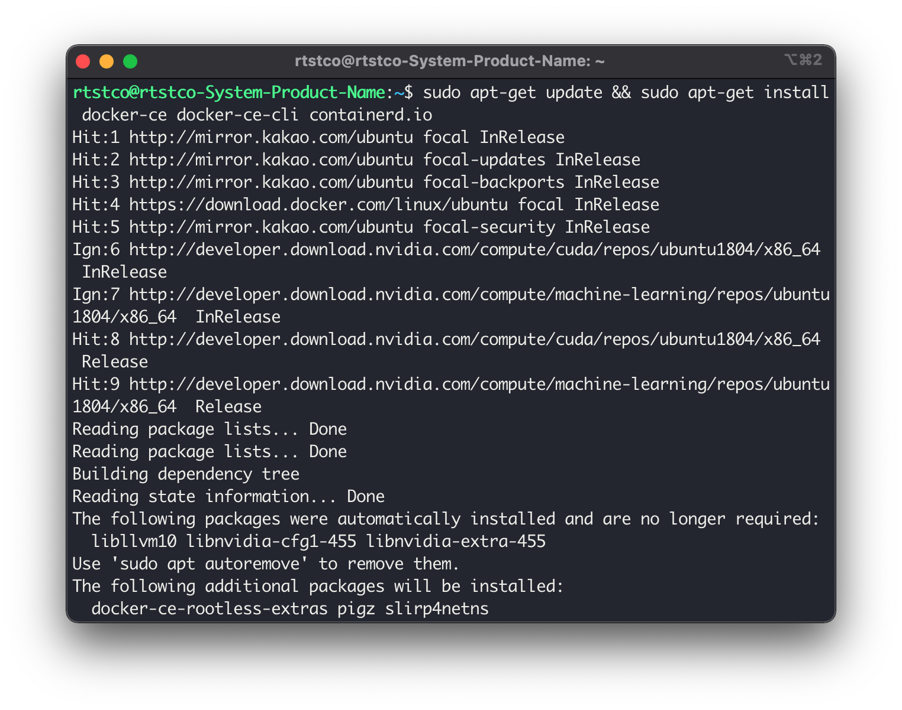
```bash 
# 7. Docker 설치 확인
$ sudo docker -v
```
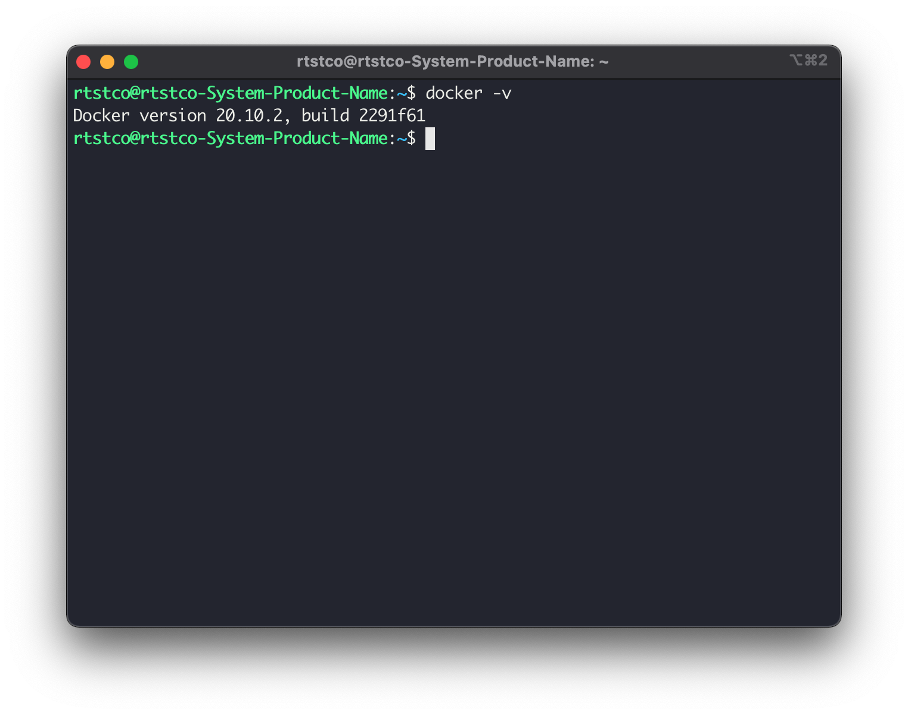
```bash 
# 8. Docker 부팅시 자동 실행 설정 후 Docker 서비스 실행
sudo systemctl enable docker && service docker start
```
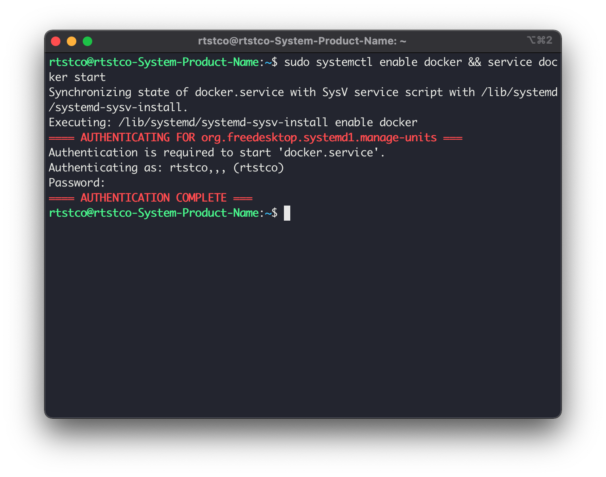
```bash 
# 9. Docker 서비스 동작 확인
sudo systemctl status docker
```
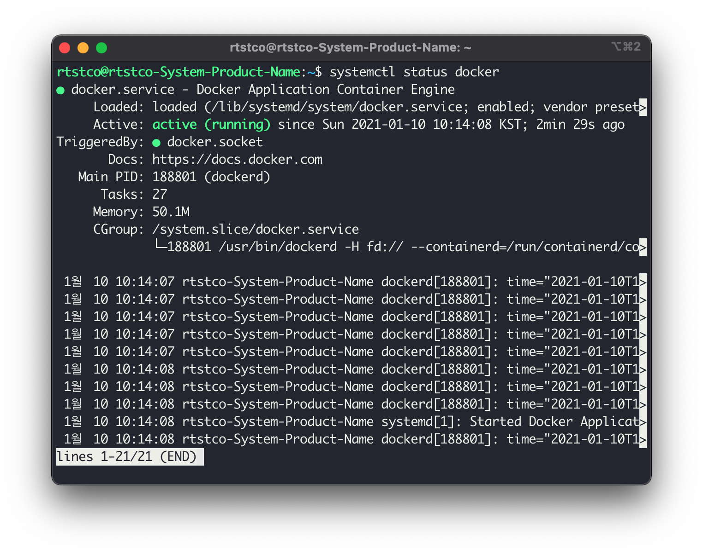

## 2. [Docker-Compose](https://github.com/docker/compose/releases) 설치
```bash
# 위 제목의 링크를 이용하여, docker-compose 버전을 설정해야 합니다. 1.28.0-rc2

# 1. docker-compose 다운로드
$ sudo curl -L https://github.com/docker/compose/releases/download/1.28.0-rc2/docker-compose-`uname -s`-`uname -m` -o /usr/local/bin/docker-compose
```
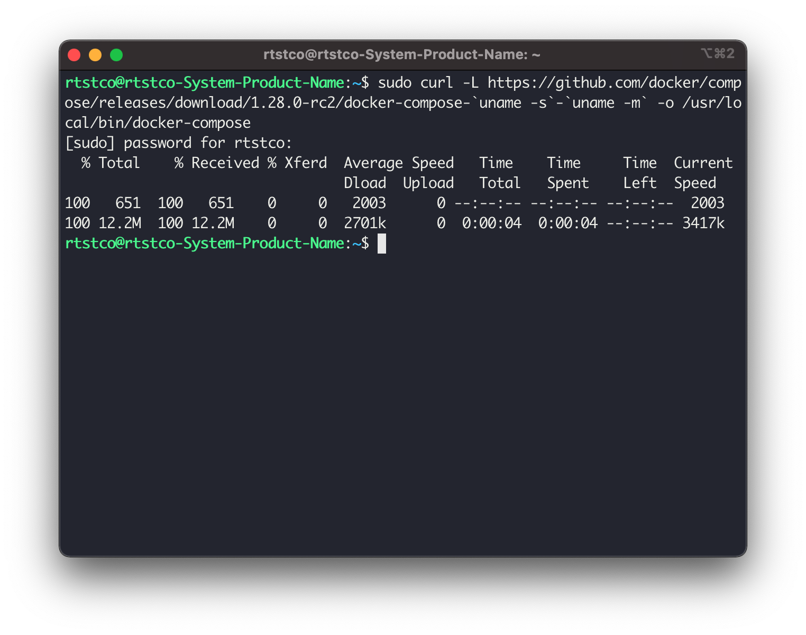
```bash 

# 2. docker-compose 실행 권한 부여
sudo chmod +x /usr/local/bin/docker-compose
```
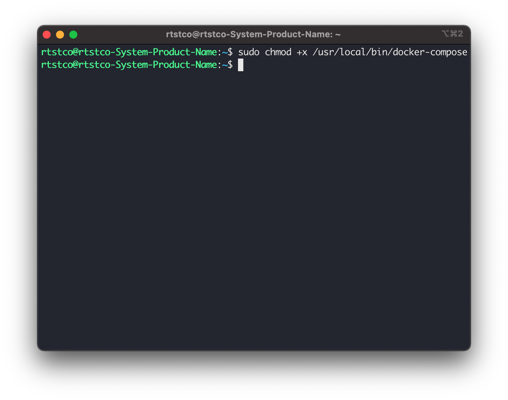
```bash
# 3. docker-compose 설치 확인
$ sudo docker-compose --version
```
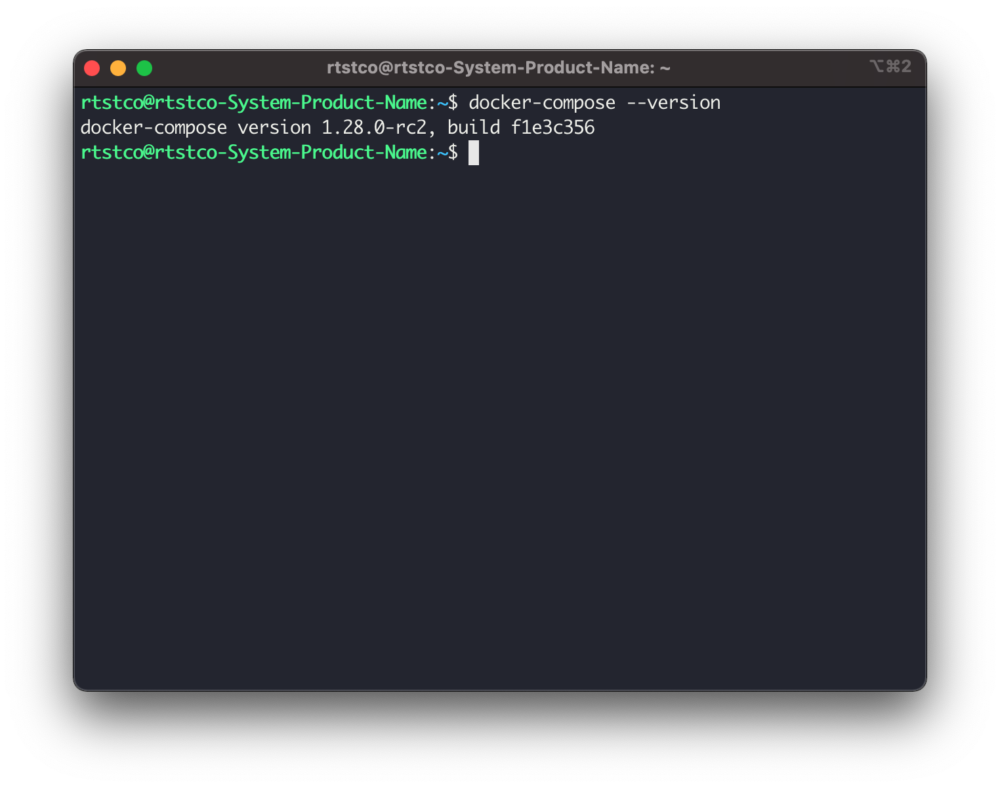


## 3. Docker 컨테이너에 고정 IP(컨터네이 내부용) 할당을 위해, 가상 네트워크 설정
```bash
$ sudo docker network create --gateway 172.18.0.1 --subnet 172.18.0.0/16 taeco 
```

## 4. Docker-compose 설정
```bash
~/web$ vi docker-compose.yml
```
```yml
# ~/web/docker-compose.yml 내용

version: '3'

services:
  db: # MariaDB 데이터베이스 컨테이너.
    image: mariadb
    container_name: db
    restart: always
    privileged: true
    networks: 
      taeco-net: 
        ipv4_address: 172.18.0.2 
    environment:
     - MYSQL_ROOT_PASSWORD=rtstco
    volumes:
      - ./volumes/mariadb:/var/lib/mysql
    ports:
      - '3306:3306'
  proxy: # 웹 서버의 로드밸런싱을 위한 프록시 웹 서버
    image: nginx
    container_name: proxy
    restart: always
    privileged: true
    networks: 
      taeco-net: 
        ipv4_address: 172.18.0.3
    depends_on:
      - db
    volumes:
      - ./proxy/nginx.conf:/etc/nginx/nginx.conf
      - ./proxy/vhost.conf:/etc/nginx/conf.d/default.conf
      - ./proxy/index.html:/usr/share/nginx/html/index.html
    ports:
      - '80:80'
      - '443:443'
    extra_hosts:
      - 'web1:172.18.0.4'
      - 'web2:172.18.0.5'
  web1: # UI 및 API 웹 서버 1번
    image: search:0.6.6
    container_name: web1
    restart: always
    networks: 
      taeco-net: 
        ipv4_address: 172.18.0.4
    depends_on:
      - proxy
    environment:
      NODE_ENV: production
      PORT: 80
      API: http://172.18.0.1:5001/ # 특허 연관성 검색 시스템 API 호출 주소
      DB_TYPE: mysql
      DB_HOST: db # 위의 선언된 MariaDB 컨테이너 이름을 지정함. 변경시, 도메인/IP 등을 사용.
      DB_PORT: 3306
      DB_NAME: DB-RTST_2101
      DB_USER: root
      DB_PASS: rtstco
      NAVER_CLIENT_ID: OT3kieLnav57fVOBXHZN # 네이버 API의 Client ID 값
      NAVER_CLIENT_SECRET: MZMHVMKiIJ # 네이버 API의 Client Secret 값
  web2: # UI 및 API 웹 서버 2번
    image: search:0.6.6
    container_name: web2
    restart: always
    networks: 
      taeco-net: 
        ipv4_address: 172.18.0.5
    depends_on:
      - proxy
    environment:
      NODE_ENV: production
      PORT: 80
      API: http://172.18.0.1:5001/ # 특허 연관성 검색 시스템 API 호출 주소
      DB_TYPE: mysql
      DB_HOST: db
      DB_PORT: 3306
      DB_NAME: DB-RTST_2101
      DB_USER: root
      DB_PASS: rtstco
      NAVER_CLIENT_ID: OT3kieLnav57fVOBXHZN # 네이버 API의 Client ID 값
      NAVER_CLIENT_SECRET: MZMHVMKiIJ # 네이버 API의 Client Secret 값
networks: 
  taeco-net: 
    external: 
      name: taeco
```

## 5. Docker-Compose를 활용한 컨테이너 관리.
### 5.1. Docker Image 등록
#### 5.1.1. Docker Image 파일을 복사합니다.
#### 5.1.2. Docker Image 파일을 등록합니다.
```bash
~/web$ sudo docker load -i search.v0.6.7.img
```
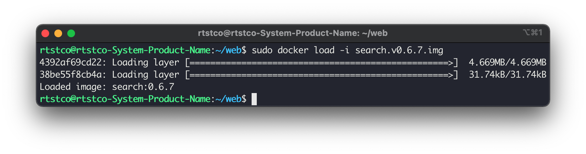

#### 5.1.3. docker-compose.yml 버전 변경.
```bash
~/web$ vi docker-compose.yml
```

```yml
# Docker Image 버전을 맞춥니다.
version: '3'

services:
  web1:
    image: search:0.6.7
  web2:
    image: search:0.6.7
```

#### 5.1.3. 컨테이너 종료
```bash
~/web$ sudo docker-compose down
```
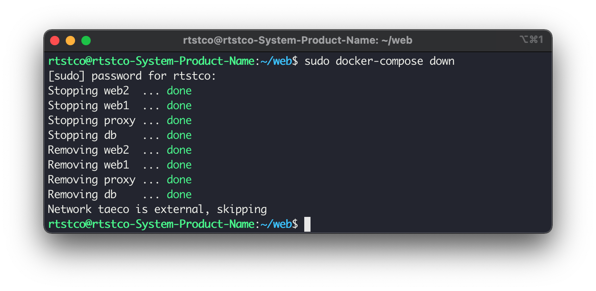

#### 5.1.3. 컨테이너 시작(데몬)
```bash
~/web$ sudo docker-compose up -d
```
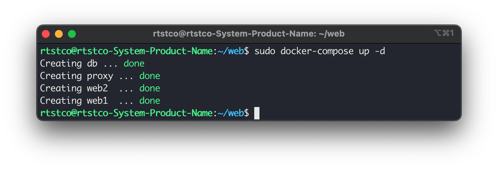

#### 5.1.4. 컨테이너 동작 상태
```bash
~/web$ sudo docker ps
```
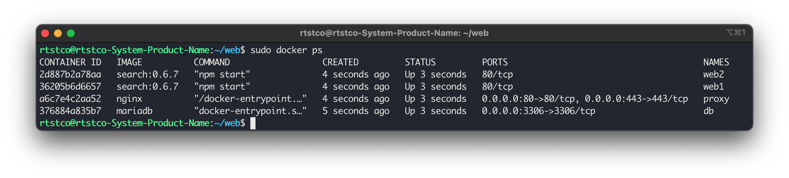
